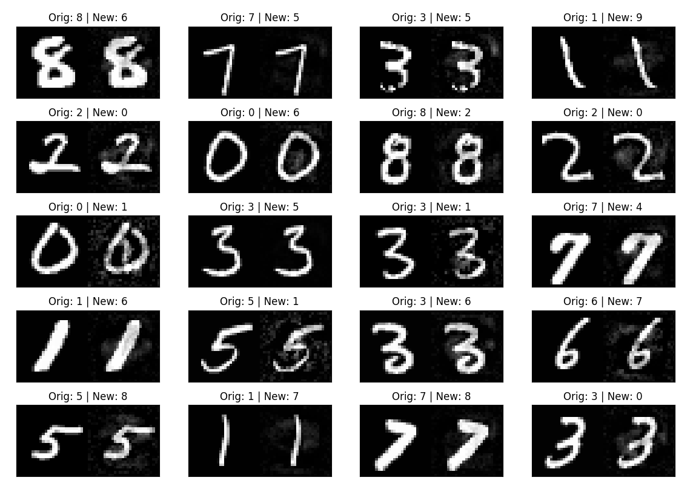
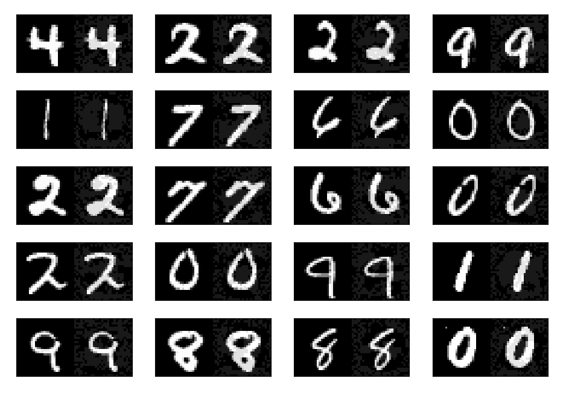
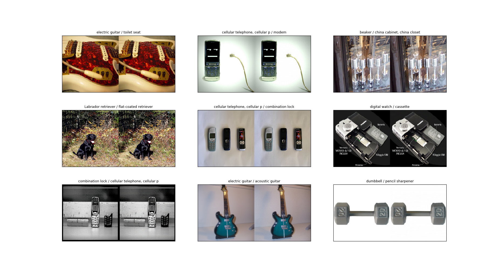

# Adversarial Examples

Adversarial examples are inputs to machine learning models that an attacker has intentionally designed to cause the model to make a mistake; they’re like optical illusions for machines. However, they look almost identical to the original inputs when seen through the naked eye. 


Adversarial examples are an important aspect of AI research due to the security concerns regarding AI's widespread use in the real world. for e.g. An adversarialized stop sign might appear like a merge symbol to a self driving car, which compromises the safety of the vehicle.

This repository is an attempt to implement 2 common methods to produce adversarial examples.The directory structure is as follows. 

```
.
+-- .gitignore --> do not track
+-- README.md --> This document.
+-- Method 1 - optimizing for noise --> Method based on [1] 
|   +-- attack.py --> Class that performs the attack
|   +-- attack_mnist.py --> use attack.py on mnist dataset
|   +-- visualize_adv_examples.py --> vis the results
+-- Method 2 - Fast gradient sign method
|   +-- imnet-fast-gradient.py --> fgsm on VGG16 w/ images from ImageNet. 
|   +-- mnist-fast-gradient.py  --> fgsm on Mnist dataset
|   +-- visualize_imnet.py 
|   +-- visualize_mnist.py
+-- common
|   +-- train_mnist.py --> train a simple nn on mnist and save to weights.pkl
|   +-- generate_5k.py --> extract 5k random mnist samples from the dataset. 
|   +-- labels.json --> map ImageNet classes <--> # between 0-999
```

## Method 1 - Optimizing for noise

In the method presented in [1] the authors find that neural networks are not stable to small perturbations in input space. Specifically, it is possible to optimize for a small perturbation that misclassifies an image but is visually similar to the original image. 
In the paper, the author use an L-BFGS optimizer to solve:

```
    minimize ||r||_2, subject to
    1. f(x+r) = l
    2. x + r in [0,1] 
    where l = target class
    r = noise 
    f = nn mapping images -> labels s.t f(x) -> k (correct class) 
```

However, in this implementation I use an SGD optimizer to find "r", I do this by fixing the input "x" and weights of the network and minimizing the cross entropy loss between network output and target label "l". 
I honor the 2nd constraint by clamping x+r to [0,1]. I also try to keep the values of "r" to a minimum by imposing L2/L1/No regularization. 

The following table shows the min, max and mean perturbation for No/L1/L2 regularization.

|                   |  Mean  |   Max   |   Min  |
|:-----------------:|:------:|:-------:|:------:|
| No regularization | 0.0151 | 1.00202 | -0.999 |
| L1 regularization | 0.0155 | 1.00323 | -1.000 |
| L2 regularization | 0.0150 | 1.00285 | -1.002 |



## Method 2 - Fast gradient sign method

In [2] the authors propose an easier method to generate adversarial examples known as fast gradient sign method. This method makes use of the idea that deep models behave in a linear manner and that a large number of small variations in a high dimensional input space can cause a significant change in the output of the model. According the the paper, an adversarial example can be generated by:

```
    x_adversarial = x + eta * sign( dL/dx )
    where
    eta = scale of perturbation
    dL/dx = gradient of loss function w.r.t. input
    sign = signum function
```

Mean, Max, Min noise: 0.0373817, 0.1, -0.1




## How to run 
```
    # Download and generate 5k mnist samples 
    cd common/ 
    python generate_5k.py # creates 5k_samples.pkl 
    
    # Train NN on mnist 
    python train_mnist.py # creates weights.pkl 
    
    # Method 1 
    cd ../Method\ 1\ -\ optimizing\ for\ noise/
    python attack_mnist.py --> generates bulk...pkl file 
    python visualize_adv_examples.py bulk...pkl # visualize adv examples on a grid
    
    # Method 2 
    cd ../Method\ 2\ -\ Fast\ gradient\ sign\ method/
    python mnist-fast-gradient.py  # runs on 5k images and creates bulk_mnist_fgsd.pkl
    python visualize_mnist.py bulk_mnist_fgsd.pkl # visualize on a grid
    
```

## Some observations 
1. FGSM is faster to compute in comparison to method 1. 
2. In FGSM, the noise is spread accross the entirety of the image instead of being localized. FGSM hence gives noticeably 'cleaner' images. 
3. The minimum epsilon required to change the classification of an image varies for each sample. Hence, to get the mimimum possible perturbation required for misclassification, one can run a bilinear search. 
4. In Method 1, it is possible to control the target class, however in FGSM it is not possible to do so. 


## References 

[1] Intriguing properties of neural networks. Szegedy et al. (ICLR 2014). [paper](https://arxiv.org/abs/1312.6199)

[2] Explaining and Harnessing Adversarial Examples. IJ Goodfellow et al. (ICLR 2015) [paper](https://arxiv.org/abs/1412.6572) 
